# Design Document

## Overview

This design enhances the existing Telegram job bot with comprehensive error handling, adds 15+ missing high-demand remote job categories, implements robust daily automation, and ensures all job sources work reliably. The system will provide 300+ daily job opportunities across all skill levels with intelligent filtering and organization.

## Architecture

### Enhanced Job Fetching Architecture

```mermaid
graph TD
    A[Daily Scheduler 6AM] --> B[Job Scout Engine]
    B --> C[Category Manager]
    C --> D[Multi-Source Fetcher]
    D --> E[Error Handler & Retry Logic]
    E --> F[Job Validator & Deduplicator]
    F --> G[Quality Scorer]
    G --> H[Category Organizer]
    H --> I[Telegram Formatter]
    I --> J[Message Sender]
    
    D --> K[Primary Sources]
    D --> L[Backup Sources]
    D --> M[Static Fallbacks]
    
    E --> N[Failure Logger]
    E --> O[Performance Monitor]
```



### Job Source Reliability System


## Components and Interfaces

### 1. Enhanced Category Manager

**Purpose**: Manages all job categories including new high-demand remote categories

**New Categories to Add**:
```python
MISSING_HIGH_DEMAND_CATEGORIES = {
    # Creative & Design
    "digital-marketing": ["digital-marketing", "seo", "sem", "marketing-automation", "growth-hacking"],
    "ux-ui-design": ["ux-designer", "ui-designer", "web-designer", "product-designer", "figma"],
    "video-editing": ["video-editor", "motion-graphics", "youtube-editor", "content-creator", "premiere"],
    "graphic-design": ["graphic-designer", "brand-designer", "logo-designer", "creative-director", "photoshop"],
    
    # Education & Training
    "online-teaching": ["online-tutor", "course-instructor", "educational-content", "curriculum-designer"],
    "coaching-consulting": ["business-coach", "life-coach", "consultant", "advisor", "mentor"],
    
    # Technical Specialized
    "cybersecurity": ["cybersecurity", "penetration-tester", "security-analyst", "ethical-hacker", "compliance"],
    "devops-cloud": ["devops", "cloud-engineer", "aws", "kubernetes", "docker", "terraform"],
    "qa-testing": ["qa-engineer", "software-tester", "automation-tester", "quality-assurance"],
    "blockchain-web3": ["blockchain", "web3", "smart-contracts", "defi", "crypto", "solidity"],
    
    # Business & Finance Specialized
    "bookkeeping-tax": ["bookkeeper", "tax-preparer", "quickbooks", "accounting-clerk", "payroll"],
    "legal-compliance": ["legal-assistant", "paralegal", "compliance-officer", "contract-reviewer"],
    "real-estate-va": ["real-estate-va", "property-manager", "listing-coordinator", "mls-specialist"],
    
    # Content & Media
    "social-media-mgmt": ["social-media-manager", "community-manager", "instagram-manager", "tiktok-manager"],
    "email-marketing": ["email-marketer", "mailchimp", "klaviyo", "marketing-automation", "copywriter"],
    "podcast-audio": ["podcast-editor", "audio-engineer", "voice-over", "sound-designer", "audacity"],
    
    # Emerging Opportunities
    "ai-prompt-engineering": ["prompt-engineer", "ai-trainer", "chatgpt-specialist", "ai-content"],
    "no-code-development": ["no-code", "bubble", "webflow", "zapier", "automation-specialist"],
    "sustainability-remote": ["sustainability-consultant", "esg-analyst", "carbon-tracking", "green-tech"]
}
```

### 2. Robust Error Handling System

**Purpose**: Ensures reliable job fetching with comprehensive error recovery

**Components**:
- `SourceHealthMonitor`: Tracks success/failure rates for each source
- `RetryManager`: Implements exponential backoff for failed requests
- `FallbackProvider`: Provides static jobs when all sources fail
- `ErrorReporter`: Logs and reports issues to user

**Interface**:
```python
class EnhancedJobFetcher:
    def fetch_with_comprehensive_error_handling(self, fetch_function, source_name, *args, **kwargs):
        # Implements retry logic, fallbacks, and error reporting
        pass
    
    def get_source_health_status(self, source_name):
        # Returns health metrics for a job source
        pass
    
    def provide_fallback_jobs(self, category, count=5):
        # Provides curated static jobs when sources fail
        pass
```

### 3. Advanced Job Quality System

**Purpose**: Scores and filters jobs for quality and relevance

**Quality Factors**:
- Company reputation (startup vs established)
- Salary competitiveness (compared to market rates)
- Job description completeness (detailed vs vague)
- Remote work friendliness (fully remote vs hybrid)
- Application process (simple vs complex)
- Scam indicators (too good to be true, vague requirements)

**Interface**:
```python
class JobQualityScorer:
    def calculate_quality_score(self, job):
        # Returns score 0-100 based on quality factors
        pass
    
    def detect_scam_indicators(self, job):
        # Returns True if job appears to be a scam
        pass
    
    def filter_high_quality_jobs(self, jobs, min_score=70):
        # Returns only jobs above quality threshold
        pass
```

### 4. Daily Automation System

**Purpose**: Ensures reliable 6am daily execution with comprehensive monitoring

**Components**:
- `ScheduleManager`: Handles cron-like scheduling
- `ExecutionMonitor`: Tracks execution time and performance
- `NotificationManager`: Sends success/failure notifications
- `RecoveryManager`: Handles partial failures gracefully

## Data Models

### Enhanced Job Model
```python
@dataclass
class EnhancedJob:
    title: str
    company: str
    location: str
    url: str
    source: str
    salary: str
    description: str = ""
    
    # New fields
    quality_score: float = 0.0
    relevance_score: float = 0.0
    skill_level: str = "entry"  # entry, intermediate, expert, flexible
    category: str = ""
    subcategory: str = ""
    company_size: str = ""  # startup, mid-size, enterprise
    remote_type: str = "fully_remote"  # fully_remote, hybrid, remote_friendly
    application_difficulty: str = "easy"  # easy, medium, hard
    posted_date: datetime = None
    expires_date: datetime = None
    requirements: List[str] = field(default_factory=list)
    benefits: List[str] = field(default_factory=list)
    is_verified: bool = False
    is_featured: bool = False
```

### Source Health Model
```python
@dataclass
class SourceHealth:
    source_name: str
    success_rate: float
    avg_response_time: float
    last_success: datetime
    last_failure: datetime
    failure_count: int
    total_requests: int
    is_healthy: bool
    status_message: str
```

## Error Handling

### Comprehensive Error Recovery Strategy

1. **Network Errors**: Retry with exponential backoff (1s, 2s, 4s, 8s)
2. **API Rate Limits**: Implement proper delays and respect rate limits
3. **Timeout Errors**: Reduce timeout gradually and use cached results
4. **Authentication Errors**: Refresh tokens or use alternative endpoints
5. **Complete Source Failure**: Switch to backup sources and static fallbacks

### Error Notification System
```python
class ErrorNotificationManager:
    def notify_source_failure(self, source_name, error_details):
        # Sends notification about failed source
        pass
    
    def notify_partial_execution(self, successful_sources, failed_sources):
        # Notifies about partial success with details
        pass
    
    def notify_complete_failure(self, error_summary):
        # Sends emergency notification for complete failure
        pass
```

## Testing Strategy

### 1. Source Reliability Testing
- Test each fetch function individually
- Simulate network failures and API errors
- Verify fallback mechanisms work correctly
- Test retry logic and exponential backoff

### 2. Job Quality Testing
- Test quality scoring algorithm with sample jobs
- Verify scam detection catches suspicious listings
- Test job deduplication logic
- Validate category classification accuracy

### 3. Daily Automation Testing
- Test scheduling system reliability
- Verify execution within time limits
- Test error recovery and notification systems
- Validate message formatting and delivery

### 4. Performance Testing
- Test with high job volumes (500+ jobs)
- Verify memory usage stays within limits
- Test concurrent API calls and rate limiting
- Validate execution time stays under 15 minutes

## Implementation Plan

### Phase 1: Fix Existing Issues
1. Audit all existing fetch functions for errors
2. Implement comprehensive error handling
3. Add missing fetch functions for existing categories
4. Test and fix failing sources

### Phase 2: Add Missing Categories
1. Add 15+ new high-demand remote job categories
2. Implement fetch functions for each new category
3. Add proper categorization and organization
4. Test all new categories thoroughly

### Phase 3: Enhance Quality and Reliability
1. Implement job quality scoring system
2. Add scam detection and filtering
3. Implement advanced deduplication
4. Add source health monitoring

### Phase 4: Robust Daily Automation
1. Implement reliable scheduling system
2. Add comprehensive error recovery
3. Implement notification system
4. Add performance monitoring and optimization

## Success Metrics

- **Reliability**: 99%+ daily execution success rate
- **Coverage**: 300+ jobs daily across all categories
- **Quality**: 90%+ of jobs pass quality threshold
- **Performance**: Complete execution in under 15 minutes
- **User Satisfaction**: Comprehensive job coverage across all skill levels